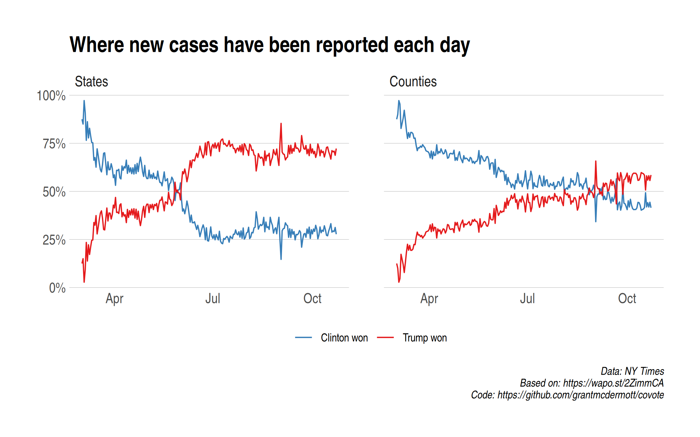
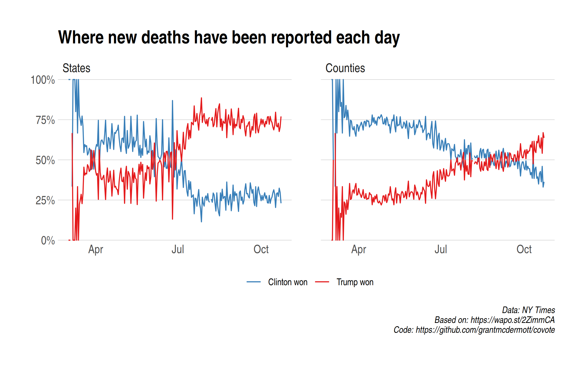
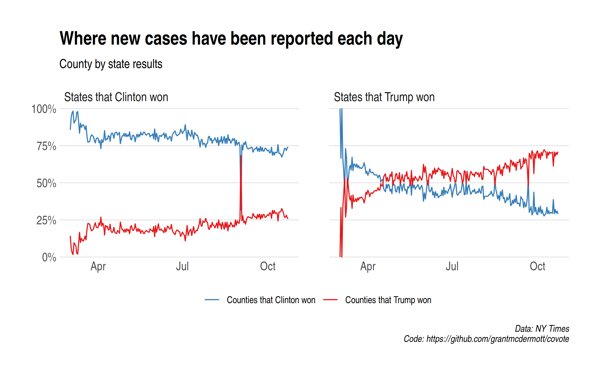
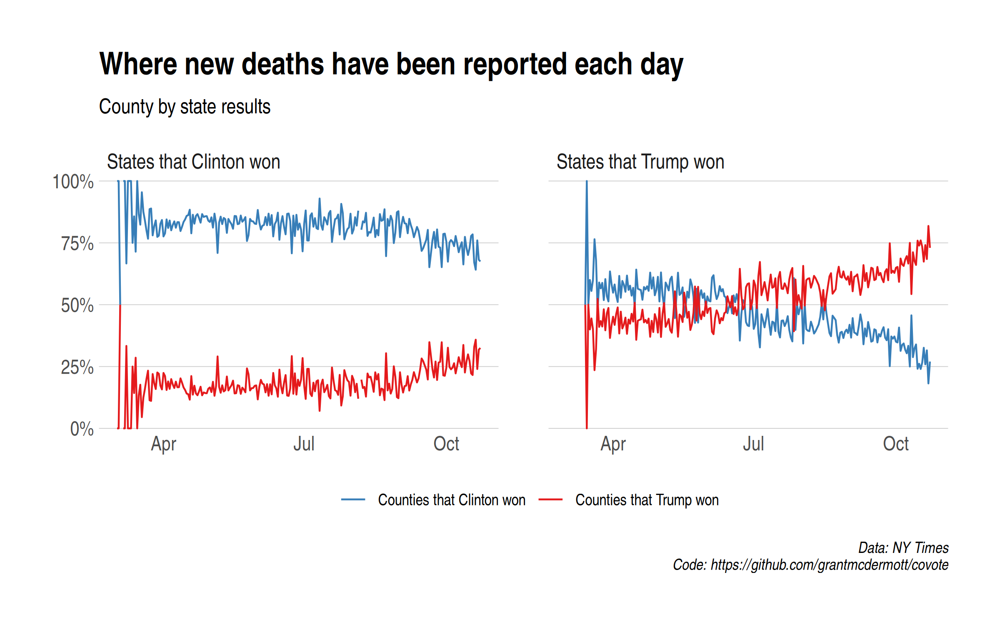

<!-- README.md is generated from README.Rmd. Please edit that file -->

# US COVID-19 cases by 2016 election vote

<!-- badges: start -->
<!-- badges: end -->

The *Washington Post* published an article on June 17, 2020, titled
[“Coronavirus has come to Trump
country”](https://www.washingtonpost.com/politics/2020/06/17/coronavirus-has-come-trump-country/).
The article included a striking figure showing daily COVID-19 cases over
time, aggregated by 2016 election results (i.e. whether a county or
state voted for Donald Trump or Hillary Clinton).

The short script below provides R code for reproducing this figure with
up-to-date data. The script was run on **2020-10-24**, but it will
automatically pull in the most recent data whenever you run it.

    library(data.table)
    library(ggplot2)
    library(hrbrthemes)

    # COVID-19 data -----------------------------------------------------------

    ## Source: NY Times COVID-19 data repo: https://github.com/nytimes/covid-19-data
    nytc = fread('https://raw.githubusercontent.com/nytimes/covid-19-data/master/us-counties.csv')
    nytc[, `:=` (date = as.Date(date), fips = sprintf('%05d', fips))]

    # 2016 election data ------------------------------------------------------

    ## Counties (Source: https://github.com/tonmcg/US_County_Level_Election_Results_08-16)
    us2016_counties = fread('https://raw.githubusercontent.com/tonmcg/US_County_Level_Election_Results_08-16/master/2016_US_County_Level_Presidential_Results.csv')
    us2016_counties =
      us2016_counties[, `:=` (fips = sprintf('%05d', combined_fips),
                              result_county = fifelse(per_dem > per_gop, 'Clinton won', 'Trump won'))] %>%
      .[, .(fips, state_abbr, result_county)]

    ## States
    us2016_states = fread('https://vincentarelbundock.github.io/Rdatasets/csv/Stat2Data/Election16.csv')
    us2016_states =
      us2016_states[, result_state := fifelse(TrumpWin==1, 'Trump won', 'Clinton won')] %>%
      .[, .(state_abbr = Abr, result_state)]

    ## Merge and melt (reshape longer)
    us2016 =
      us2016_counties[us2016_states, on='state_abbr'] %>%
      melt(id = c('fips', 'state_abbr'), variable.name = 'geo', value.name = 'result') %>%
      .[, geo := gsub('result_', '', geo)]

    # Merge -------------------------------------------------------------------

    us =
      nytc[us2016, on = 'fips', allow.cartesian = TRUE] %>%
      .[!is.na(date),
        lapply(.SD, sum, na.rm = TRUE), .SDcols = c('cases', 'deaths'),
        by = .(date, geo, result)]

    ## Get daily counts and percentages
    setorder(us, geo, result, date)
    us[ , ':=' (daily_cases = cases - shift(cases, 1, 'lag'),
                daily_deaths = deaths - shift(deaths, 1, 'lag')),
        by = .(geo, result)] %>%
      .[, ':=' (daily_cases_perc = daily_cases/sum(daily_cases),
                daily_deaths_perc = daily_deaths/sum(daily_deaths)),
        by = .(geo, date)]

    ## Some labeling sugar to match the WaPo graphic
    us$geo = factor(us$geo, levels = c('state', 'county'), labels = c('States', 'Counties'))

    # Plot(s) -----------------------------------------------------------------

    theme_set(
      theme_ipsum(grid = 'Y') +
        theme(legend.title = element_blank(),
              legend.position = 'bottom',
              axis.title.x = element_blank(),
              axis.title.y = element_blank())
      )

    ## Cases
    ggplot(us[date>'2020-03-01'], aes(date, daily_cases_perc, col = result)) +
      geom_line() +
      scale_color_brewer(palette = 'Set1', direction = -1) +
      scale_y_percent(limits = c(0,1)) +
      labs(title = 'Where new cases have been reported each day',
           caption = 'Data: NY Times\nBased on: https://wapo.st/2ZimmCA\nCode: https://github.com/grantmcdermott/covote') +
      facet_wrap(~ geo)

<!-- -->

    ## Deaths
    ggplot(us[date>'2020-03-01'], aes(date, daily_deaths_perc, col = result)) +
      geom_line() +
      scale_color_brewer(palette = 'Set1', direction = -1) +
      scale_y_percent(limits = c(0,1)) +
      labs(title = 'Where new deaths have been reported each day',
           caption = 'Data: NY Times\nBased on: https://wapo.st/2ZimmCA\nCode: https://github.com/grantmcdermott/covote') +
      facet_wrap(~ geo)

<!-- -->

### Bonus: County by state results

Here’s a variation that wasn’t in the original WaPo article, but might
be of interest. Among other things, looking at county-by-state results
gives us some insight into whether it is better to be a Democratic in a
red state, or a Republican in a blue state.

    ## New county by state data table
    uscs =
      nytc[us2016_counties[us2016_states, on='state_abbr'], on = 'fips', allow.cartesian = TRUE] %>%
        .[!is.na(date),
          lapply(.SD, sum, na.rm = TRUE), .SDcols = c('cases', 'deaths'),
          by = .(date, result_state, result_county)]

    ## Get daily counts and percentages
    setorder(uscs, result_state, result_county, date)
    uscs[ , ':=' (daily_cases = cases - shift(cases, 1, 'lag'),
                  daily_deaths = deaths - shift(deaths, 1, 'lag')),
          by = .(result_state, result_county)] %>%
      .[, ':=' (daily_cases_perc = daily_cases/sum(daily_cases),
                daily_deaths_perc = daily_deaths/sum(daily_deaths)),
        by = .(result_state, date)]

    ## Some labeling sugar 
    uscs$result_state = factor(paste('States that', uscs$result_state))
    uscs$result_county = factor(paste('Counties that', uscs$result_county))

    ## Cases
    ggplot(uscs[date>'2020-03-01'], aes(date, daily_cases_perc, col = result_county)) +
      geom_line() +
      scale_color_brewer(palette = 'Set1', direction = -1) +
      scale_y_percent(limits = c(0,1)) +
      labs(title = 'Where new cases have been reported each day',
           subtitle = 'County by state results',
           caption = 'Data: NY Times\nCode: https://github.com/grantmcdermott/covote') +
      facet_wrap(~ result_state)

<!-- -->

    ## Deaths
    ggplot(uscs[date>'2020-03-01'], aes(date, daily_deaths_perc, col = result_county)) +
      geom_line() +
      scale_color_brewer(palette = 'Set1', direction = -1) +
      scale_y_percent(limits = c(0,1)) +
      labs(title = 'Where new deaths have been reported each day',
           subtitle = 'County by state results',
           caption = 'Data: NY Times\nCode: https://github.com/grantmcdermott/covote') +
      facet_wrap(~ result_state)

<!-- -->

## Acknowledgements

-   [Original WaPo article by Philip
    Bump](https://www.washingtonpost.com/politics/2020/06/17/coronavirus-has-come-trump-country/)
-   [NY Times COVID-19 Data](https://github.com/nytimes/covid-19-data)
-   [US 2016 election results by county (Tony
    McGovern)](https://github.com/tonmcg/US_County_Level_Election_Results_08-16)
-   [US 2016 election results by state (Vincent
    Arel-Bundock)](https://vincentarelbundock.github.io/Rdatasets/)
